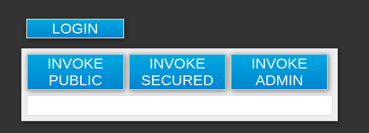

# Este projeto demonstra o uso do RH-SSO com uma aplicação frontend acessando backend;

> Este projeto foi feito com base no projeto https://github.com/stakater/keycloak-kubernetes-demo

## Versões usadas:
* Openshift: `4.12.x`
* Red Hat Single Sign-On (RHSSO): `7.6`
* Frontend (PHP-Apache): `7.0 - Apache/2.4.25`
* Backend (Node): `9.11.2`
* Utilitário jq

## RHSSO
> Nesta demo não será instalado o RHSSO será apenas usado um configuração existente no cluster.
* Foi usado o Operator do RHSSO a instaciado conforme arquivo [Keycloak.yaml](keycloak/sso.yaml)
* Uma vez o RHSSO funcionando importar o [Realm DEMO](keycloak/realm.json) que já tem configurado o client `app` que usa o protocolo *openid-connect* e tipo de acesso como *público*.


Veja a seguir nas seções de acordo com o seu foco **DEV** ou **OPS**. 
  
## DEV

* Veja como construir na pasta de cada projeto:
* [Frontend](frontend/README.md)
* [Backend](backend/README.md)

## OPS

### Variáveis usadas
```shell
$ RHSSO_NS=rhsso
$ export RHSSO_HOST=$(oc -n $RHSSO_NS get route/keycloak -o=jsonpath='{.spec.host}')
$ echo $RHSSO_HOST
```

### Configuração do Projeto

```shell
# criar um projeto para executar o frontend e backend
$ oc new-project rhsso-openshift-demo
# habilitar permissão de anyuid apenas neste projeto (pois a imagem roda na porta 80)
$ oc adm policy add-scc-to-user anyuid -z default
```

### Implantar o Backend e Frontend
```shell
# ajustar HOST do rhsso
$ sed -i "s/keycloak-rhsso.apps-crc.testing/${RHSSO_HOST}/g" k8s/rhsso-config.yml
# deploy
$ oc create -f k8s/
```

### Validar/Testar
```shell
# abrir no browser a url do frontend
$ oc get route/frontend -o=jsonpath='{.spec.host}'
```
> O aplicativo front-end agora deve ser aberto em seu navegador (URL obtida no comando anterior). 



1. Veja que o backend expõe método público que se encontra acessível mesmo sem o login:
```shell
# abrir no browser a url do frontend
$ export BACKEND_HOST=$(oc get route/backend -o=jsonpath='{.spec.host}')
$ echo $BACKEND_HOST
# permite acess anonymous
$ curl "${BACKEND_HOST}/public"    
{"message":"public"}

# requer autenticação (qualquer)
$ curl "${BACKEND_HOST}/secured"
Access denied%  

# precisa ter a role de admin
$ curl "${BACKEND_HOST}/admin"  
Access denied%
```

2. Entre com `stian/pass`: Você deve ser capaz de invocar público e seguro, mas não invocar administrador. 

3. Para poder invocar o administrador, volte ao console de administração do Keycloak e adicione a função `admin` ao usuário `stian`.

4. Caso queira validar o acesso usando linha de comando, deverá ser habilitado para o client *app* a propriedade `Direct Access Grants Enabled` pela interface web. Posteriomente poderá testar:
```shell
REALM=demo
CLIENT_ID=app
UNAME=stian
PASSWORD=pass

ACCESS_TOKEN=$(curl -k \
  -d "client_id=$CLIENT_ID"  \
  -d "username=$UNAME" -d "password=$PASSWORD" \
  -d "grant_type=password" \
  "https://$RHSSO_HOST/auth/realms/$REALM/protocol/openid-connect/token" | jq -r '.access_token')

echo $ACCESS_TOKEN

$ curl -k -H "Authorization: Bearer $ACCESS_TOKEN" "${BACKEND_HOST}/secured"
{"message":"secured"}%

$ curl -k -H "Authorization: Bearer $ACCESS_TOKEN" "${BACKEND_HOST}/admin"
```


# Referências e Guias

- https://github.com/jovemfelix/keycloak-kubernetes-demo